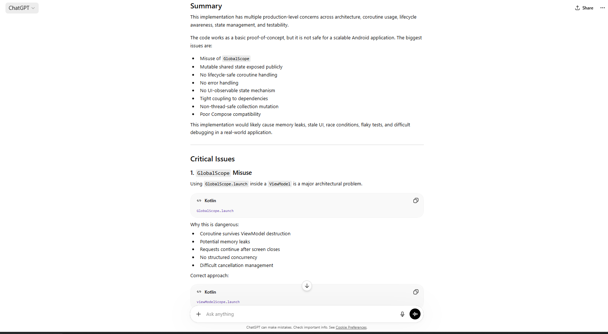

# AI Pair Engineer


## AI-Assisted Android Architecture & Code Quality Companion

---

# Vision

The future of software engineering is AI-augmented development — where AI accelerates engineering workflows while experienced engineers remain responsible for architecture, business logic, scalability, and product decisions.

---

# Candidate

**Muhammad Tanveer**
Senior Staff Software Engineer – Android
Karachi, Pakistan

---

# Overview

AI Pair Engineer is an AI-assisted software engineering companion designed to help Android development teams improve code quality, maintainability, scalability, and development velocity.

The assistant works alongside developers during implementation and code review phases by analyzing Kotlin code and providing architecture-aware recommendations before human review begins.

Unlike generic code review bots, AI Pair Engineer focuses specifically on real-world Android engineering challenges including:

* CLEAN Architecture
* MVVM/MVI architecture
* Jetpack Compose state management
* Coroutines and Flow best practices
* Dependency Injection
* scalability and modularization
* memory and lifecycle safety
* testing strategy
* maintainability and readability

The goal is not to replace human engineers, but to augment development workflows by automating repetitive engineering validations and accelerating feedback loops.

---

# Problem Statement

Modern Android applications have become increasingly complex due to:

* asynchronous programming
* reactive architectures
* modularized systems
* rapidly evolving frameworks
* scalability requirements
* distributed teams

Engineering teams often face:

* delayed code reviews
* inconsistent architecture enforcement
* hidden performance issues
* lifecycle bugs
* insufficient testing
* architecture drift across teams

Traditional static analysis tools detect syntax or lint issues, but they lack contextual understanding of:

* architecture quality
* maintainability
* scalability
* business logic organization
* real-world Android engineering practices

AI Pair Engineer aims to bridge this gap.

---

# Proposed Solution

AI Pair Engineer reviews Kotlin and Android code snippets using an AI-powered engineering review workflow.

The assistant analyzes:

* code structure
* architecture decisions
* concurrency patterns
* state management
* dependency injection usage
* testability
* performance considerations

Then it provides:

* actionable improvements
* refactoring suggestions
* architecture guidance
* testing recommendations
* positive engineering feedback

This creates a faster and more consistent engineering review process.

---

# Key Features

## Architecture Review

* Detects violations of CLEAN Architecture principles
* Identifies tight coupling
* Flags business logic inside UI layers
* Suggests repository/domain separation

## Coroutine & Flow Analysis

* Detects unsafe coroutine usage
* Identifies improper dispatcher usage
* Reviews Flow lifecycle handling
* Suggests structured concurrency improvements

## Compose Best Practices

* Reviews state hoisting
* Detects unnecessary recompositions
* Suggests immutable UI state patterns
* Reviews side-effect handling

## Dependency Injection Review

* Detects manual dependency creation
* Encourages Hilt/Dagger best practices
* Suggests interface abstractions

## Testability Review

* Suggests unit tests
* Identifies hard-to-test components
* Detects missing abstractions

## Performance & Stability

* Detects potential memory leaks
* Reviews lifecycle awareness
* Flags blocking operations
* Suggests optimization opportunities

## Maintainability

* Improves readability
* Detects code smells
* Encourages modularization
* Suggests naming improvements

---

# Example AI Review Prompt

```text
You are a Senior Android Staff Engineer performing a production-grade code review.

Review the provided Kotlin Android code for:

1. Architecture quality
2. Readability and maintainability
3. Coroutine and Flow correctness
4. Performance issues
5. Dependency Injection best practices
6. Compose state management issues
7. Testability concerns
8. Scalability risks

Output format:

- Summary
- Critical Issues
- Improvements
- Suggested Refactor
- Suggested Unit Tests
- Positive Feedback

Code:
[PASTE CODE HERE]
```

---

# Example Input

```kotlin
class UserViewModel : ViewModel() {

    val users = mutableListOf<User>()

    fun fetchUsers() {
        GlobalScope.launch {
            val response = api.getUsers()
            users.clear()
            users.addAll(response)
        }
    }
}
```

---

# Example AI Review Output

```text
Summary:
The ViewModel works functionally but contains major architectural and coroutine-safety concerns that could create lifecycle issues and memory leaks.

Critical Issues:
1. GlobalScope should not be used inside ViewModel
2. Mutable shared state is exposed directly
3. No exception handling exists
4. No loading or UI state management
5. ViewModel is tightly coupled to networking layer

Improvements:
- Replace GlobalScope with viewModelScope
- Use StateFlow for observable immutable state
- Introduce Repository abstraction
- Add proper exception handling
- Inject dependencies using Hilt

Suggested Refactor:
Implement MVVM + Repository architecture using immutable UI state and structured concurrency.

Suggested Unit Tests:
- Success response validation
- API failure handling
- Loading state verification
- Empty state handling

Positive Feedback:
The implementation is concise and readable, making it a strong starting point for refactoring.
```

---

# Improved Refactored Version

```kotlin
@HiltViewModel
class UserViewModel @Inject constructor(
    private val repository: UserRepository
) : ViewModel() {

    private val _uiState = MutableStateFlow(UserUiState())
    val uiState: StateFlow<UserUiState> = _uiState

    fun fetchUsers() {
        viewModelScope.launch {
            _uiState.update { it.copy(isLoading = true) }

            runCatching {
                repository.getUsers()
            }.onSuccess { users ->
                _uiState.update {
                    it.copy(
                        users = users,
                        isLoading = false
                    )
                }
            }.onFailure {
                _uiState.update {
                    it.copy(
                        error = it.message,
                        isLoading = false
                    )
                }
            }
        }
    }
}
```

---

# High-Level System Design

## Workflow

1. Developer submits code snippet
2. AI Pair Engineer processes prompt
3. LLM analyzes architecture and logic
4. Rule engine validates Android-specific patterns
5. AI generates structured review
6. Developer receives recommendations

---

# Proposed Technical Stack

| Layer           | Technology                  |
| --------------- | --------------------------- |
| Frontend        | Streamlit / Web UI          |
| AI Model        | OpenAI GPT / HuggingFace    |
| Language        | Kotlin + Python             |
| Backend         | FastAPI                     |
| Static Analysis | Android Lint + Detekt       |
| Hosting         | GitHub / HuggingFace Spaces |
| CI/CD           | GitHub Actions              |

---

# Android Engineering Focus Areas

## Jetpack Compose

* recomposition analysis
* state hoisting
* side-effect handling
* UI stability

## Coroutines

* structured concurrency
* cancellation handling
* dispatcher correctness
* lifecycle awareness

## Flow

* cold vs hot flow usage
* StateFlow optimization
* SharedFlow misuse detection
* flow collection lifecycle issues

## Architecture

* modularization
* domain separation
* repository pattern
* use case orchestration

## Testing

* ViewModel testability
* fake repository suggestions
* Flow testing recommendations
* coroutine test dispatcher guidance

---

# Future Enhancements

* GitHub Pull Request integration
* Android Studio plugin
* Kotlin Multiplatform support
* AI-generated unit tests
* Architecture scoring system
* CI/CD pipeline integration
* Team knowledge learning system
* Static analysis + LLM hybrid review
* PR summarization
* Security vulnerability scanning

---

# Why I Chose This Problem

As an Android engineer working on enterprise and consumer applications, I have experienced the challenges of:

* scaling engineering quality
* maintaining architecture consistency
* mentoring developers
* reducing technical debt
* improving review efficiency

This concept was inspired by real-world engineering problems I encountered while building scalable Android applications across distributed Agile teams.

I believe AI can significantly improve engineering workflows when used as a collaborative assistant rather than a replacement for human expertise.

---

# Public Resources

## GitHub Repository

[https://github.com/emtanveer/ai-pair-engineer](https://github.com/emtanveer/ai-pair-engineer)

---

# Screenshots

## Example AI Review



---

## Architecture Feedback

.png)

.png)

---

## Refactor Suggestions

.png)

.png)

.png)

---

# Repository Structure

```text
ai-pair-engineer-careem/
│
├── README.md
├── LICENSE
├── .gitignore
│
├── prompts/
│   └── android_review_prompt.txt
│
├── examples/
│   └── bad_viewmodel_example.kt
│
├── screenshots/
│   ├── review-output-1.png
│   ├── architecture-feedback(1).png
│   ├── architecture-feedback(2).png
│   ├── refactor-suggestion(1).png
│   ├── refactor-suggestion(2).png
│   └── refactor-suggestion(3).png
```

---

# 100-Word Summary For Application Form

AI Pair Engineer is a lightweight AI-assisted Android development companion focused on improving code quality, architecture consistency, and engineering velocity. The assistant reviews Kotlin code before human review and provides actionable recommendations related to CLEAN Architecture, Coroutines, Flow, Dependency Injection, Compose state management, scalability, and testing. The goal is to reduce review cycles, catch architectural issues earlier, and improve maintainability across large mobile codebases. I designed the concept around real-world Android engineering challenges I’ve experienced while leading and contributing to enterprise and consumer applications across distributed Agile teams.

---

# Final Note

The assistant is designed to augment engineering teams rather than replace human code review, focusing on repetitive architectural validation, rapid feedback loops, and scalable engineering quality.
